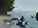
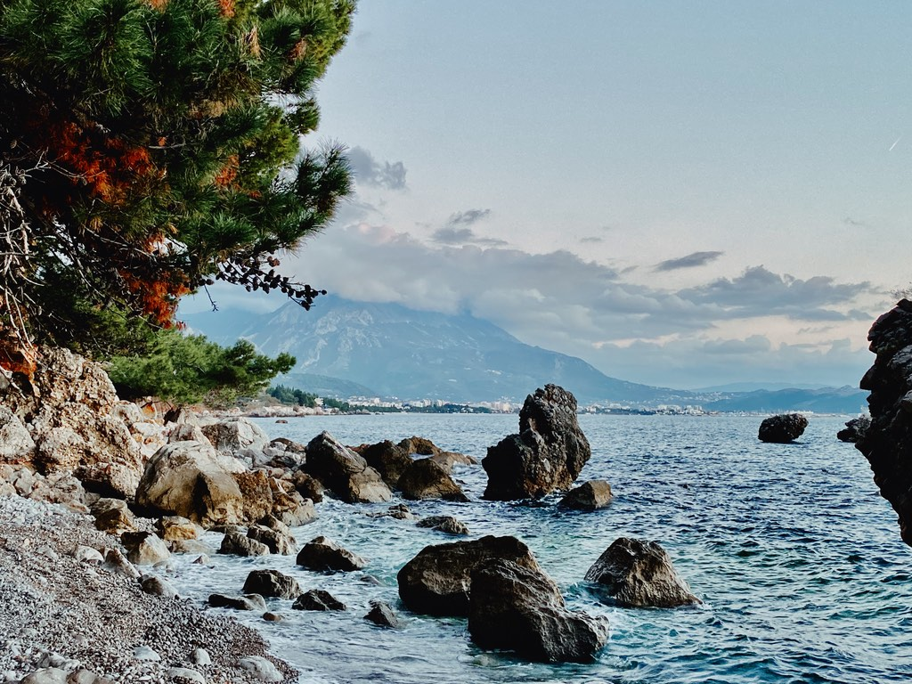

imgpreview
==========

This is a Go program that generates tiny blurry previews for images that you can embed
into HTML, so that your website visitors have something to look at while the image loads,
similar to https://engineering.fb.com/2015/08/06/android/the-technology-behind-preview-photos/. **It uses no JavaScript, only inline CSS** (that embeds an SVG image that embeds a tiny WebP image).

Example:

> ``````

The additional payload is only 500-600 bytes longer than an `img` tag without the preview.
(If we used JavaScript, we could avoid adding the SVG, and strip the WebP header to
get ~150-200-byte payloads. Something to do for a future version).

Caveats
-------

1. Only works if the browser knows the image size (`img` tags have `width` and `height` or set with CSS).
2. Doesn't work with transparent images, since the preview image is the image background
(however, this can be fixed with JavaScript to remove background from CSS after the image loads).
3. Only works in browsers that support SVG and WebP (all modern browsers do).

How it works
------------

The original image is resized to maximum 42x42 pixels preserving the aspect ratio (configurable with the `-s` option) and encoded as WebP
with very low quality (quality is adjustable with `-q` option):



This WebP is then converted to Base64 data URI:

```
data:image/webp;base64,UklGRpAAAABXRUJQVlA4IIQAAAAwBACdASoqAB8AP8nU3GY/tCwnMAqr8DkJQAAPpCFvc1+gv4l5aLFvwFAA/t6qZ8zzfS7wWsF7C1w3IqQr9kr+ZPlFjfNGZ2lwqYWHQyJIZFzzQtDn3ar3HSw3W1XGLQPQyj3HZfadC+YJaBAYTTtOJeZamHk6s4FnBHNNLgIwECcAAAA=
```

The result is then embedded into an SVG that applies a gaussian blur filter to it
(we can't use the CSS `blur` filter because it will blur the whole image,
not its background):

```svg
<svg xmlns="http://www.w3.org/2000/svg">
  <defs>
    <filter id="f">
    <feGaussianBlur stdDeviation="10"/>
    </filter>
  </defs>
  <image width="100%" height="100%" filter="url(#f)" href="data:image/webp;base64,UklGRpAAAABXRUJQVlA4IIQAAAAwBACdASoqAB8AP8nU3GY/tCwnMAqr8DkJQAAPpCFvc1+gv4l5aLFvwFAA/t6qZ8zzfS7wWsF7C1w3IqQr9kr+ZPlFjfNGZ2lwqYWHQyJIZFzzQtDn3ar3HSw3W1XGLQPQyj3HZfadC+YJaBAYTTtOJeZamHk6s4FnBHNNLgIwECcAAAA="/>
</svg>
```

(unlike this demo, the actual SVG is minimized and quoted)

The amount of blur is controlled with `-b` option, 10 by default.


The SVG image is then converted into a data URI (quoted as required or encoded as Base64 if you pass `-base64` option), and you get the following CSS to use
in the `style` attribute of your image:

```css
background: url('data:image/svg+xml,%3Csvg xmlns=%22http://www.w3.org/2000/svg%22%3E%3Cdefs%3E%3Cfilter id=%22f%22%3E%3CfeGaussianBlur stdDeviation=%2210%22/%3E%3C/filter%3E%3C/defs%3E%3Cimage width=%22100%%22 height=%22100%%22 filter=%22url(%23f)%22 href=%22data:image/webp;base64,UklGRpAAAABXRUJQVlA4IIQAAAAwBACdASoqAB8AP8nU3GY/tCwnMAqr8DkJQAAPpCFvc1+gv4l5aLFvwFAA/t6qZ8zzfS7wWsF7C1w3IqQr9kr+ZPlFjfNGZ2lwqYWHQyJIZFzzQtDn3ar3HSw3W1XGLQPQyj3HZfadC+YJaBAYTTtOJeZamHk6s4FnBHNNLgIwECcAAAA=%22/%3E%3C/svg%3E') no-repeat 100%
```

Or, if you set `-tag` option, the program will output the ready-to-use `img` tag:

```html

```

The actual preview will be sized to the image when the HTML loads:


After the browser loads the original image, it will be shown on top of that background:




Installation
------------

To install, you need Go and a C compiler (e.g., Xcode on a Mac).
Use `go get github.com/dchest/imgpreview` to install the program (ignore compiler warnings).

If there's a demand, I may eventually make binaries for macOS available. Or someone can make
a homebrew package.

Usage
-----

Basic:

```
imgpreview example.jpg
```

will output the CSS to put into the `style` attribute of your image.

```
imgpreview -tag example.jpg
```

will output the `img` tag to use.

Options:

```
Usage of imgpreview:
  -b int
    	blur (default 10)
  -base64
    	encode SVG as Base64 instead of quoting
  -q int
    	WebP quality (0-100) (default 1)
  -s int
    	maximum preview side size (default 42)
  -svg
    	output the preview SVG to stdout
  -tag
    	output img tag
  -webp
    	output the preview WebP to stdout
```
